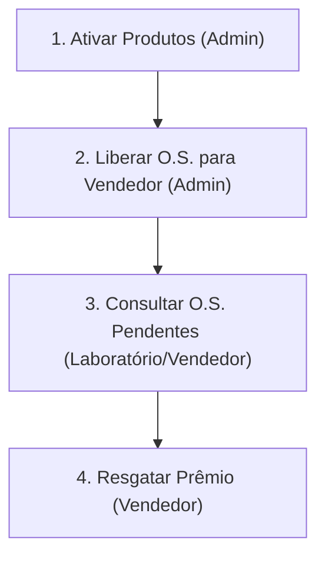
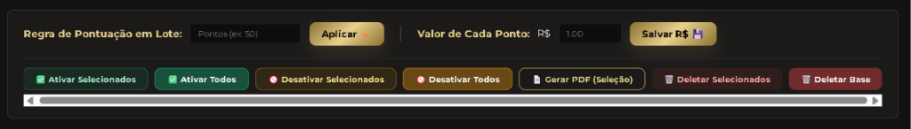
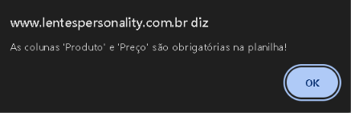
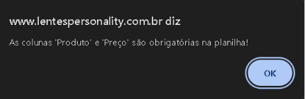
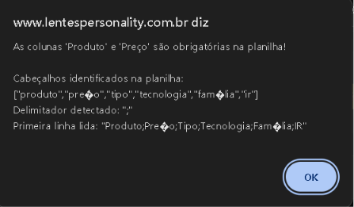

# 📖 Manual de Uso: Resgate de Prêmios e Liberação de O.S.

Este manual descreve o passo a passo operacional para administradores e vendedores utilizarem a plataforma de premiação da **Personality Lentes**. O sistema baseia-se na regra de conversão de **1 Ponto = R$ 1,00**.

---

## 🗺️ Fluxo de Funcionamento Geral

O processo de premiação é composto por 4 etapas simples e integradas:

---

## 💸 1. Configuração do Catálogo e Ativação em Lote

Antes de liberar pontos para uma O.S., os produtos e tratamentos devem estar cadastrados e marcados como **Ativos** na campanha.

### Barra de Ações em Lote
Use as ferramentas em lote para atualizar a pontuação ou o status de múltiplos itens simultaneamente.

### Passo a Passo para Ativar/Desativar em Lote:
1. Marque as caixas de seleção na primeira coluna à esquerda dos produtos desejados (ou clique na caixinha do cabeçalho da tabela para selecionar todos da página).
2. Clique no botão de ação correspondente:
   * **Ativar Selecionados:** Permite que apenas as lentes/tratamentos selecionados fiquem disponíveis para pontuação.
   * **Desativar Selecionados:** Oculta os itens selecionados do buscador de O.S.
   * **Ativar Todos / Desativar Todos:** Altera o status do catálogo completo em um único clique.
3. Você também pode ativar/desativar individualmente clicando na caixa da coluna **Ativo**.

---

## 📥 2. Liberar Vendas / O.S. para Vendedores

Para que um vendedor possa resgatar seus pontos, o laboratório ou administrador precisa fazer o pré-lançamento da O.S. vinculando o vendedor e os produtos vendidos.

### Buscador Rápido e Separado de Produtos
* O formulário organiza as lentes e tratamentos na mesma linha para facilitar o preenchimento rápido.
* O sistema filtra de forma inteligente: apenas os produtos que estão marcados como **Ativo** na etapa anterior serão listados.

### Sequência para Liberar O.S.:
1. Insira o **Número da O.S. / Pedido**.
2. Selecione o **Vendedor Proprietário** no menu dropdown.
3. Digite o **Nome do Paciente / Cliente**.
4. Use os filtros rápidos de **Família**, **Tipo** e **IR** para localizar a Lente.
5. Selecione a **Lente** e o **Tratamento Antirreflexo** vendidos.
6. Confira o somador automático de pontos e valor em dinheiro no rodapé do formulário.
7. Clique em **Liberar O.S. 🚀**.

---

## 📋 3. Gerenciamento de O.S. Liberadas

Todas as O.S. pré-lançadas e pendentes de resgate são exibidas na tabela administrativa para controle e auditoria.

### Visualização Inteligente com Toggle Detalhes
A tabela oculta as colunas secundárias para otimizar o espaço e a legibilidade na tela:

* **Botão `[+]` (Detalhes):** Clique no botão mais à esquerda de qualquer linha para expandir e verificar o CPF do vendedor, clínica/loja, nome do cliente e a data da liberação.
* **Ação Editar (✏️):** Permite recarregar todos os dados da O.S. diretamente no formulário para correção rápida.
* **Ação Excluir (🗑️):** Cancela a liberação da O.S. do sistema de comissões.

---

## 📊 4. Resgate do Prêmio pelo Vendedor

Uma vez liberada pelo administrador, a O.S. fica elegível para resgate. O vendedor realiza a conversão em dinheiro através da sua área de login pessoal:

### Fluxo de Resgate:
1. O vendedor acessa a tela de resgate de prêmios.
2. Digita o **Número da O.S. Liberada**.
3. O sistema busca automaticamente os dados da O.S. cadastrada e exibe a pontuação total acumulada (Lente + AR).
4. O vendedor escolhe se quer resgatar o valor correspondente em dinheiro ou prêmio.
5. Confirma a operação. O status da O.S. mudará automaticamente de **Pendente** para **Resgatada ✅** no painel administrativo.

---

> [!TIP]
> **Como salvar em PDF?**
> Para gerar uma versão física ou digital em PDF deste manual, pressione **Ctrl + P** em seu navegador nesta página e escolha a opção **"Salvar como PDF"**.
